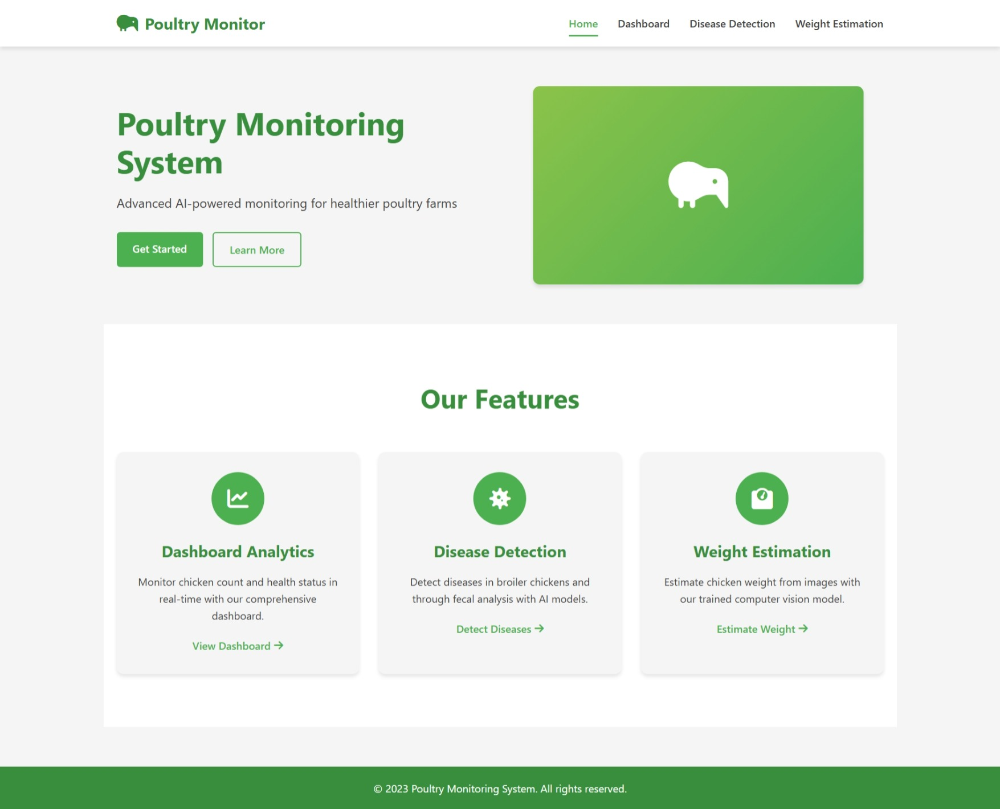
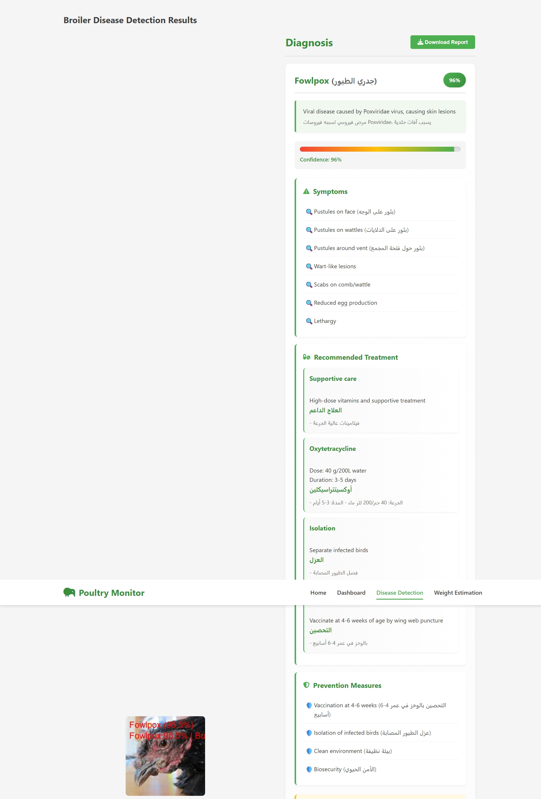
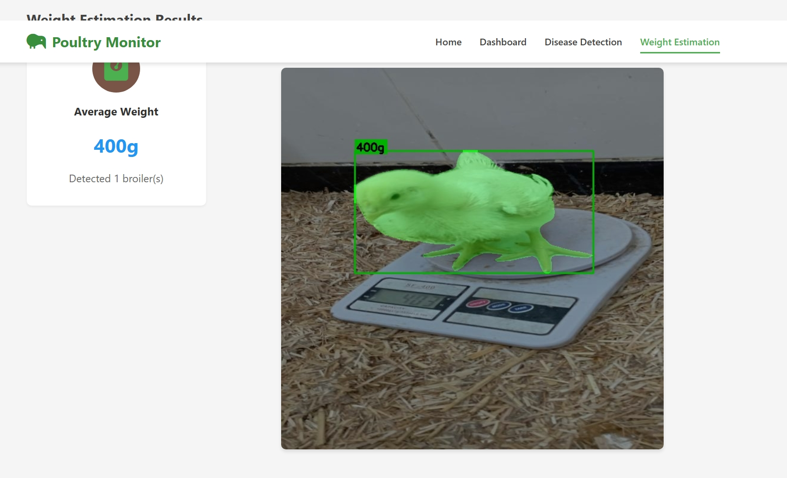
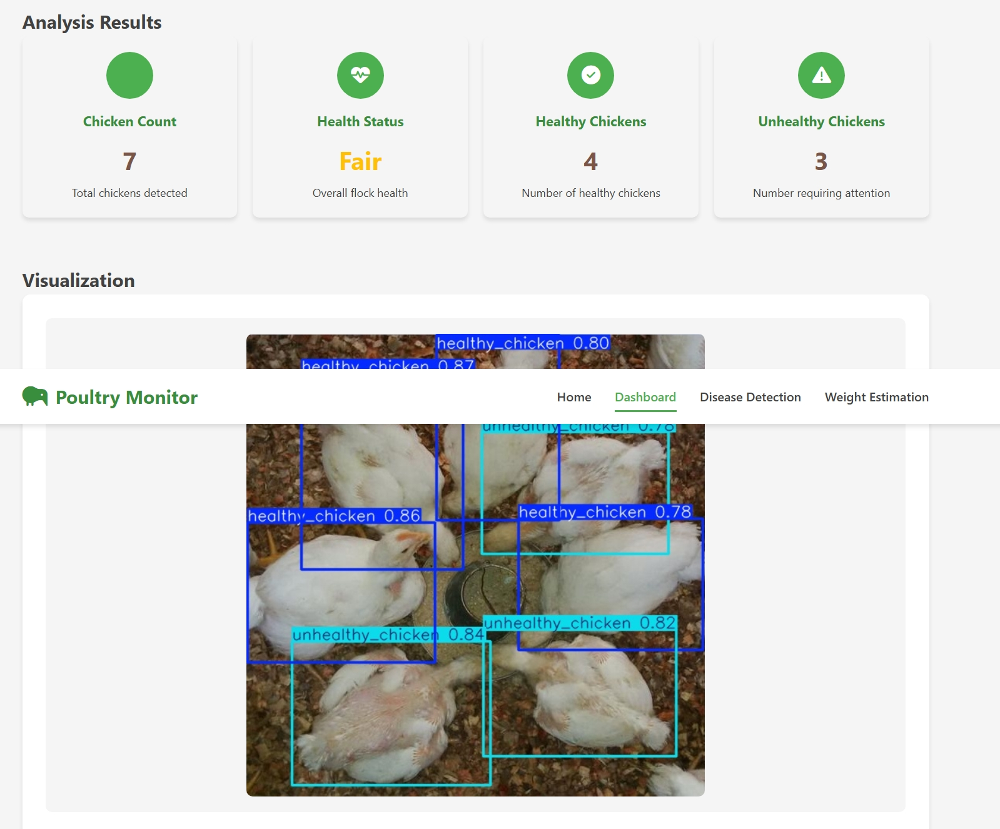

# Poultry Monitoring System



A comprehensive AI-powered solution for monitoring and managing poultry health, including disease detection, weight estimation, and farm management.

## 📸 Sample Outputs

### Disease Detection


### Weight Estimation


### Poultry Dashboard



## 🌟 Features

- **Disease Detection**: AI-powered detection of common poultry diseases including:
  - Bumblefoot
  - Fowlpox
  - Coryza
  - Chronic Respiratory Disease (CRD)
  - Coccidiosis
  - Newcastle Disease
  - Salmonella

- **Weight Estimation**: Computer vision-based broiler weight estimation
- **Multi-modal Analysis**: Support for both image and video analysis
- **Multi-language Support**: Interface available in English and Arabic
- **Responsive Web Interface**: Built with Flask for the backend and modern web technologies
- **Mobile App**: Cross-platform mobile application built with Flutter

## 🛠️ Technical Stack

### Backend
- **Framework**: Python Flask
- **AI/ML**: 
  - PyTorch for deep learning models
  - YOLOv8 for object detection and segmentation
  - EfficientNetB3 for disease classification
  - Custom CNN models for specialized tasks

### Frontend (Web)
- HTML5, CSS3, JavaScript
- Chart.js for data visualization
- Responsive design for all devices

### Mobile App (Flutter)
- Cross-platform mobile application
- Real-time monitoring and alerts
- Integration with backend services

## 🚀 Getting Started

### Prerequisites
- Python 3.8+
- PyTorch
- Flask
- OpenCV
- Ultralytics (YOLOv8)
- Flutter (for mobile app development)

### Installation

1. **Clone the repository**
   ```bash
   git clone https://github.com/Adhameissa/Poultry-Monitoring-System.git
   cd Poultry-Monitoring-System
   ```

2. **Set up a virtual environment**
   ```bash
   python -m venv venv
   source venv/bin/activate  # On Windows: venv\Scripts\activate
   ```

3. **Install Python dependencies**
   ```bash
   pip install -r requirements.txt
   ```

4. **Download model weights**
   - Place the following model files in the project root:
     - `best.pt` (YOLOv8 detection model)
     - `bestweight.pt` (Weight estimation model)
     - `best_broiler_model.pth` (Broiler disease classification model)
     - `efficientnetb3-Chicken_Disease-95.66.pth` (Fecal disease classification model)

5. **Run the Flask application**
   ```bash
   python app.py
   ```
   The web interface will be available at `http://localhost:5000`

## 📱 Mobile App Setup

1. **Install Flutter** (if not already installed)
   - Follow the official Flutter installation guide: https://flutter.dev/docs/get-started/install

2. **Navigate to the Flutter app directory**
   ```bash
   cd flutter_app
   ```

3. **Get dependencies**
   ```bash
   flutter pub get
   ```

4. **Run the app**
   ```bash
   flutter run
   ```

## 📊 Project Structure

```
Poultry-Monitoring-System/
├── app.py                 # Main Flask application
├── best.pt               # YOLOv8 detection model
├── bestweight.pt         # Weight estimation model
├── best_broiler_model.pth # Broiler disease classification model
├── efficientnetb3-Chicken_Disease-95.66.pth  # Fecal disease classification model
├── data.yaml             # Configuration file for YOLO models
├── predict_broiler_fixed.py  # Broiler disease prediction module
├── static/               # Static files (CSS, JS, images)
├── templates/            # HTML templates
├── uploads/              # Temporary storage for uploaded files
├── outputs/              # Output files (results, processed images)
└── flutter_app/          # Mobile application source code
    ├── lib/              # Flutter application code
    ├── pubspec.yaml      # Flutter dependencies
    └── ...
```

## 📝 Usage

### Web Interface
1. Access the web interface at `http://localhost:5000`
2. Upload images or videos for analysis
3. View detailed reports and visualizations
4. Access historical data and analytics

### Mobile App
1. Launch the Flutter app
2. Connect to your farm's monitoring system
3. Receive real-time alerts and notifications
4. Monitor poultry health on the go

## 🤝 Contributing

Contributions are welcome! Please feel free to submit a Pull Request.

## 📄 License

This project is licensed under the MIT License - see the [LICENSE](LICENSE) file for details.

## 📧 Contact

For any inquiries, please contact the project maintainers.

## 🙏 Acknowledgments

- YOLOv8 by Ultralytics
- PyTorch community
- Flutter framework
- All open-source libraries used in this project
